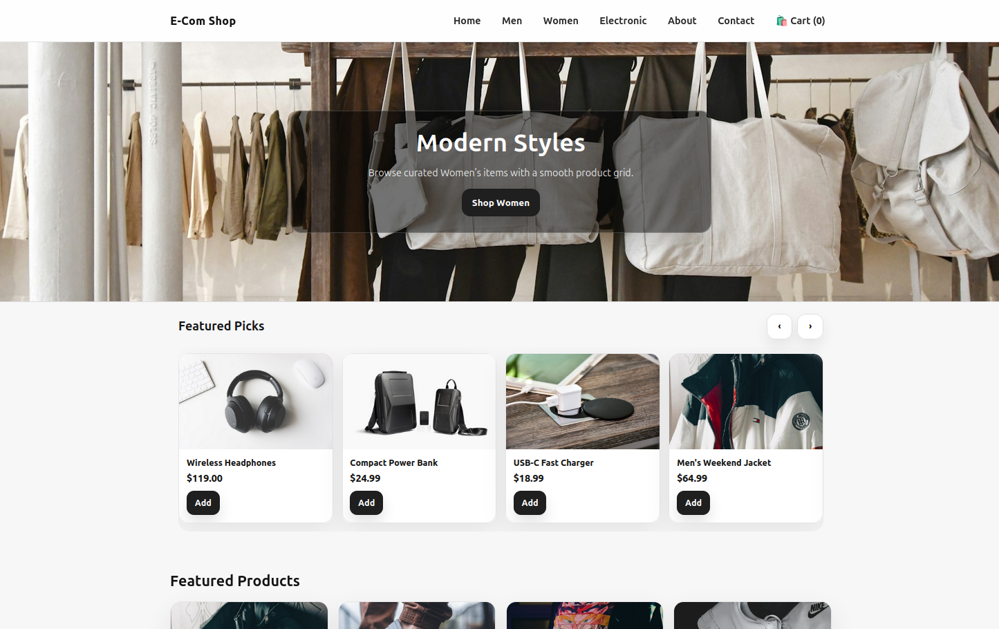

# 🛒 HTML / CSS / JavaScript eCommerce Template

<p align="center">
  
</p>

A modern, lightweight eCommerce website template built using **plain HTML, CSS, and JavaScript**.  
No frameworks. No build tools. No dependencies.

Designed to be **beginner-friendly**, easy to customize, and simple to understand.

---

## ✨ Features

- 📦 Product catalog powered by a single `items.json` file
- 🧭 Category pages (Men, Women, Electronics)
- ⭐ Featured items mini carousel
- 🛍️ Quantity-based shopping cart (saved in localStorage)
- 🔔 Toast notifications when items are added to cart
- 📱 Fully responsive layout (mobile + desktop)
- 🧠 Beginner-friendly “How to Edit Products” help section
- 🎨 Clean, modern UI with subtle animations
- ⚖️ MIT Licensed

---

## 📁 Project Structure

```
/
├── index.html
├── pages/
│   ├── men.html
│   ├── women.html
│   ├── electronic.html
│   ├── cart.html
│   ├── about.html
│   └── contact.html
├── css/
│   ├── style.css
│   ├── cart.css
│   └── contact.css
├── js/
│   ├── main.js
│   ├── cart.js
│   └── animations.js
├── data/
│   └── items.json
└── images/
    ├── men/
    ├── women/
    └── electronics/
```

---

## 🧩 How Products Work (Beginner Friendly)

All products live inside:

```
/data/items.json
```

Each product looks like this:

```json
{
  "id": 1,
  "name": "Men's Black Jacket",
  "price": 59.99,
  "image": "men/mens_jacket.jpg",
  "category": "men",
  "featured": true
}
```

### Field Explanation

- **id** → Must be unique (no duplicates)
- **name** → Product name shown on the site
- **price** → Number only (no `$` sign)
- **image** → Path inside the `/images` folder
- **category** → `men`, `women`, or `electronics`
- **featured** → `true` shows in the Featured Picks carousel

---

## ⭐ Featured Picks Carousel

To control what shows in the Featured Picks carousel:

```json
"featured": true
```

Set it to `false` to hide the item from the carousel.

The About page automatically explains this for non-technical users.

---

## 🛒 Cart Behavior

- Items added to cart are stored in **localStorage**
- Quantity buttons allow increment/decrement
- Cart persists on refresh
- Demo checkout clears the cart

(No payment gateway included by default.)

---

## 🚀 Getting Started

### Option 1: Open Locally
Open `index.html` directly in your browser.

### Option 2: Use a Local Server (Recommended)
Some browsers block local JSON loading. Use a local server:

```bash
python -m http.server
```

Then open:

```
http://127.0.0.1:8000
```

---

## 🧪 Demo Notes

- Checkout is **demo-only**
- All products and images are placeholders
- No backend required

---

## 🧠 Who This Is For

- Beginners learning HTML / CSS / JavaScript
- Developers wanting a clean starter template
- Portfolio projects
- Demos or mock storefronts
- Anyone who wants **no framework overhead**

---

## 📄 License

MIT License  
© Thomas Davis, 2026

You are free to use, modify, and distribute this project.

---

## 🙌 Credits

Built with:
- HTML5
- CSS3
- Vanilla JavaScript
- Animate.css

No frameworks. No bundlers. No nonsense.
